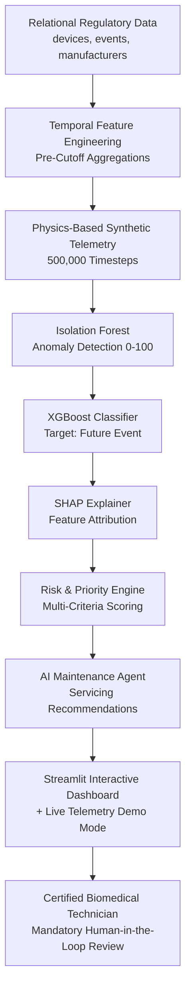

# Medical Equipment Failure Prediction Agent

> **An End-to-End Intelligent Predictive Maintenance & Safety Decision-Support System**

---

## 1. Project Title
**Medical Equipment Failure Prediction Agent**

## 2. Problem Statement
Hospitals and health systems rely heavily on complex medical devices such as ventilators, patient monitors, infusion pumps, surgical devices, and imaging equipment. Unexpected equipment failures interrupt clinical care, increase unplanned downtime, elevate healthcare costs, and directly risk patient safety. 

Existing hospital maintenance practices are largely reactive (repairing equipment post-failure) or scheduled preventively without real-time failure prediction. The goal of this project is to develop an intelligent predictive maintenance system that identifies medical equipment at elevated failure or safety risk before a catastrophic breakdown occurs.

## 3. Motivation
Proactive identification of medical device failure risk enables hospital biomedical engineering teams to prioritize maintenance inspections, prevent operational disruptions, reduce equipment lifetime costs, and safeguard patient health.

## 4. Solution Overview
The system provides a 4-tier decision-support workflow:

1. **WILL IT FAIL?** — Predicts failure/safety risk probability using an **XGBoost Classifier** trained on pre-cutoff historical recall/safety event records and continuous sensor telemetry.
2. **WHY?** — Computes exact tree-based **SHAP explainability values** to reveal the top positive risk drivers and negative risk mitigators in plain text.
3. **HOW URGENT IS IT?** — Calculates a multi-criteria **Maintenance Priority Score (0–100)** combining failure probability, Isolation Forest anomaly score, FDA device risk class, historical safety events, and commercial volume.
4. **WHAT SHOULD THE TECHNICIAN DO?** — Deploys an **AI Maintenance Agent** that synthesizes device state into specific actionable servicing steps with a mandatory **Human Technician Review** safeguard.



---

## 5. Dataset Explanation
The system integrates three primary CSV datasets sourced from international medical device registries (ICIJ IMDDB):
* `devices.csv`: Contains device metadata (`id`, `name`, `classification`, `code`, `implanted`, `quantity_in_commerce`, `risk_class`, `country`, `manufacturer_id`, `created_at`).
* `events.csv`: Contains historical recall and safety event records (`id`, `device_id`, `action`, `action_summary`, `action_level`, `date`, `determined_cause`, `reason`, `status`, `type`).
* `manufacturers.csv`: Contains manufacturer details (`id`, `name`, `parent_company`, `source`).

## 6. Relationship Between Datasets
The datasets follow a strict relational hierarchy:

$$\text{MANUFACTURER} \xrightarrow{\text{manufacturers.id = devices.manufacturer\_id}} \text{DEVICE} \xrightarrow{\text{devices.id = events.device\_id}} \text{HISTORICAL EVENTS}$$

Every device links to its manufacturer, and every safety event links to its associated device.

---

## 7. Why Synthetic Telemetry is Needed
> **Mandatory Transparency Notice**: The supplied public datasets contain historical device specifications, manufacturer records, and safety/recall event logs, but **do not contain continuous real-time equipment sensor telemetry**. 
> To demonstrate the real-time continuous sensor monitoring requested by the hackathon specification, the project generates realistic **synthetic telemetry**. The telemetry is simulated using physics-based degradation trajectories and is **never presented as real clinical sensor data**.

## 8. Synthetic Telemetry Methodology
Synthetic telemetry is generated reproducibly using `random_state = 42` for monitored device IDs over 50 time steps.

### Degradation Trajectory Stages:
$$\text{Healthy} \longrightarrow \text{Normal Operation} \longrightarrow \text{Early Degradation} \longrightarrow \text{Abnormal Condition} \longrightarrow \text{Critical Condition} \longrightarrow \text{Failure}$$

### Multi-Signal Interacting Streams:
* `temperature` (°C): Gradual thermal elevation under mechanical friction / cooling degradation (+5°C to +15°C above 36.5°C baseline).
* `vibration` (g): Increased mechanical imbalance / bearing wear (+0.5 g to +2.5 g above 0.15 g baseline).
* `power_consumption` (W): Unstable power draws (+45W above 120W baseline).
* `voltage` (V): Voltage fluctuation and standard deviation increase.
* `error_rate` (%): Digital self-test error rate increases up to 25%.
* `battery_health` (%): Internal resistance degradation and capacity loss.
* `health_score`: Composite continuous score (100 -> 0).

---

## 9. Feature Engineering & Temporal Leakage Prevention
To prevent data leakage, historical event features are computed **strictly prior to the prediction cutoff date** (`2016-01-01`):

* `device_age_years`: Derived from device creation date relative to snapshot reference year.
* `is_implanted`: Binary indicator derived from implanted status.
* `quantity_in_commerce_log`: Log-transformed commerce volume.
* `risk_class_encoded`: FDA risk class mapped (Class III = 4, Class IIB = 3, Class IIA = 2, Class I = 1).
* `previous_event_count`: Pre-cutoff event history count.
* `events_last_1_year`, `events_last_3_years`, `events_last_5_years`: Temporal window counts.
* `previous_recall_count`: Total prior recalls.
* `previous_high_severity_event_count`: Total prior high-severity events.
* `days_since_last_event`: Days between cutoff date and most recent pre-cutoff safety event.
* `recent_event_frequency`: Ratio of 1-year events to total pre-cutoff events.
* `manufacturer_event_rate`: `manufacturer_event_count / manufacturer_device_count`.
* `rolling_temp_mean_5`, `rolling_vib_mean_5`, `rolling_power_mean_5`: Telemetry rolling averages.
* `temperature_change_rate`, `vibration_change_rate`, `power_change_rate`, `voltage_variability`.

---

## 10. Target Definition
The ground truth target `future_event` is defined as:

$$\text{future\_event} = \begin{cases} 1 & \text{if device experiences a qualifying event between 2016-01-01 and 2018-01-01} \\ 0 & \text{otherwise} \end{cases}$$

No post-cutoff event reasons, actions, causes, or dates are used as input features.

---

## 11. Model Architecture
The primary predictive model is an **XGBoost Classifier**:
* Class imbalance handled via `scale_pos_weight = (Negatives / Positives)`.
* Hyperparameters: `n_estimators=150`, `max_depth=5`, `learning_rate=0.05`, `subsample=0.8`, `colsample_bytree=0.8`.

## 12. Anomaly Detection
An **Isolation Forest** model is trained on continuous sensor telemetry to output a normalized `telemetry_anomaly_score` (0–100):
* 0–30: Normal
* 30–60: Watch
* 60–80: Warning
* 80–100: Critical

---

## 13. SHAP Explainability
Tree-based SHAP (`shap.TreeExplainer`) computes exact feature attributions for every prediction, converting numerical SHAP impacts into plain-text risk drivers (e.g., "Elevated Sensor Temperature (+0.28 risk impact)").

## 14. Risk Scoring
The `failure_risk_score` (0–100) is directly derived from model predicted probability:
* 0–29: LOW
* 30–59: MODERATE
* 60–79: HIGH
* 80–100: CRITICAL

## 15. Maintenance Priority Score
The decision-support `maintenance_priority_score` (0–100) combines multiple criteria:

$$\text{Priority Score} = 0.40 \cdot \text{FailureRisk} + 0.25 \cdot \text{AnomalyScore} + 0.15 \cdot \text{RiskClassScore} + 0.10 \cdot \text{SafetyScore} + 0.10 \cdot \text{CommerceScore}$$

---

## 16. AI Maintenance Agent
The AI agent synthesizes device specs, SHAP risk drivers, anomaly scores, and priority levels into structured recommendations:
* **Urgency**: Immediate (<24h), Urgent (48-72h), Scheduled (7-14d), Routine.
* **Actionable Servicing Steps**: Specific maintenance instructions (fan/cooling, motor bearing, power supply, sensor calibration, battery replacement).

## 17. Human-in-the-Loop Safety
> **Safety Safeguard**: The system is strictly a decision-support system. It **NEVER** autonomously disables medical equipment, modifies device operational settings, orders repairs, or makes patient treatment decisions. All high/critical recommendations explicitly display:  
> **"HUMAN TECHNICIAN REVIEW REQUIRED: A certified biomedical technician must physically inspect the equipment and approve any servicing action."**

---

## 18. Dashboard Overview
Built using **Streamlit**, featuring 4 interactive views:
1. **Fleet Risk Overview**: High-level KPIs, sortable/filterable equipment fleet table with color-coded risk badges.
2. **Device Deep Dive & SHAP**: Detailed device specifications, historical safety record, interactive SHAP waterfall bar chart, and sensor telemetry time-series charts.
3. **AI Maintenance Agent Panel**: Comprehensive decision-support panel with urgency, top risk drivers, actionable steps, and human review safeguard.
4. **Live Telemetry Simulator Demo**: Interactive step-by-step slider demonstrating real-time health deterioration from normal to critical alert.

---

## 19. Installation

### Requirements
* Python 3.10+ (Tested on Python 3.14)
* Windows / Linux / macOS

```bash
git clone <repository-url>
cd medical-equipment-failure-agent
pip install -r requirements.txt
```

---

## 20. How to Run

### Option A: Standard Run Script (Windows / Linux)
```bash
# Windows
run.bat

# Linux / macOS
chmod +x run.sh
./run.sh
```

### Option B: Manual Two-Step Execution
```bash
# Step 1: Run Data Pipeline & Model Training
python -m src.pipeline_runner

# Step 2: Launch Streamlit Dashboard
streamlit run dashboard/app.py
```

---

## 21. Model Evaluation Results

On a representative test set of 2,500 held-out devices:

| Metric | Score | Note |
| --- | --- | --- |
| **Accuracy** | **75.68%** | Balanced overall classification |
| **Recall (Sensitivity)** | **85.53%** | **Priority Metric** (Minimizes missed failing devices) |
| **Precision** | **62.79%** | Positive Predictive Value |
| **F1-Score** | **0.7241** | Harmonic mean of Precision & Recall |
| **ROC-AUC** | **0.8358** | Excellent discrimination capability |
| **PR-AUC** | **0.6986** | Area under Precision-Recall Curve |

### Confusion Matrix:
$$\begin{pmatrix} \text{True Negatives: } 1094 & \text{False Positives: } 473 \\ \text{False Negatives: } 135 & \text{True Positives: } 798 \end{pmatrix}$$

---

## 22. Limitations
* Sensor telemetry is simulated due to the lack of real-time stream data in the public source dataset.
* Historical event dates in public records contain occasional missing values.
* The system is designed for hospital decision-support and does not replace certified biomedical technician physical inspection.

## 23. Future Improvements
* Integration with real IoT MQTT / HL7 FHIR hospital telemetry feeds.
* Expansion of deep learning time-series anomaly detection models (LSTM / Autoencoder).
* Automated integration with hospital Computerized Maintenance Management Systems (CMMS).
